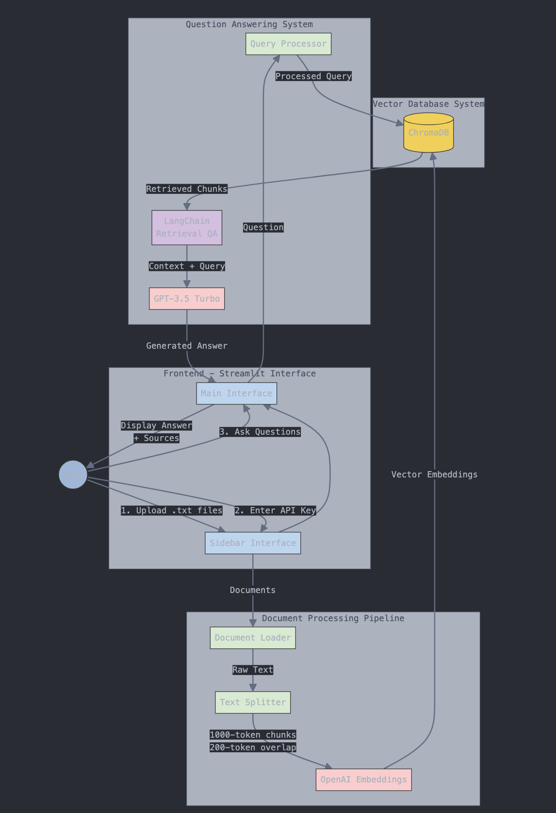

# 🤖 DocuQuery AI - Interactive Document Q&A System

A Streamlit-powered application that enables interactive question-answering over your document collection using OpenAI's GPT models and ChromaDB for efficient document retrieval.

## 📁 Project Structure

```
docuquery-ai/
│
├── app.py              # Main Streamlit application
├── requirements.txt    # Project dependencies
└── README.md          # Documentation
```

## 🔄 System Architecture



## 🌟 Features

- **Interactive Web Interface**: Clean and intuitive Streamlit-based UI
- **Secure API Key Management**: Secure handling of OpenAI API credentials
- **Multiple Document Support**: Upload and process multiple text files simultaneously
- **Smart Document Processing**: Efficient text chunking and embedding generation
- **Vector Search**: Utilizing ChromaDB for efficient similarity search
- **Source Attribution**: Every answer comes with source references

## 🚀 Getting Started

### Prerequisites

- Python 3.8 or higher
- OpenAI API key

### Installation

1. Clone the repository:

```bash
git clone https://github.com/raviX007/multi_doc_query_ai.git
cd multi_doc_query_ai
```

2. Install required packages:

```bash
pip install -r requirements.txt
```

### Running the Application

1. Start the Streamlit app:

```bash
streamlit run app.py
```

2. Step 1 automatically opens your app on browser otherwise open your web browser and navigate to the provided URL (typically `http://localhost:8501`)

## 📝 Usage Guide

1. **API Key Setup**

   - Enter your OpenAI API key in the sidebar
   - The key is securely stored for the session

2. **Document Upload**

   - Upload your text files using the sidebar uploader
   - Multiple files can be uploaded simultaneously
   - Click "Process Documents" to initialize the system

3. **Asking Questions**
   - Type your question in the main interface
   - View answers and source attribution
   - Ask follow-up questions as needed

## 🛠️ Technical Details

### Core Components

1. **Document Processing**

```python
text_splitter = RecursiveCharacterTextSplitter(chunk_size=1000, chunk_overlap=200)
texts = text_splitter.split_documents(documents)
```

2. **Vector Store Creation**

```python
vectordb = Chroma.from_documents(
    documents=texts,
    embedding=embedding,
    persist_directory=persist_directory
)
```

3. **QA Chain Setup**

```python
qa_chain = RetrievalQA.from_chain_type(
    llm=turbo_llm,
    chain_type="stuff",
    retriever=retriever,
    return_source_documents=True
)
```

### Dependencies

```txt
langchain
openai
tiktoken
chromadb
streamlit
```

## 🔧 Configuration

Key configuration parameters in `app.py`:

```python
# Chunk size for document splitting
chunk_size=1000
chunk_overlap=200

# Number of relevant chunks to retrieve
search_kwargs={"k": 2}

# LLM temperature setting
temperature=0
model_name='gpt-3.5-turbo'
```

## 🚨 Error Handling

The application includes comprehensive error handling for:

- Invalid API keys
- File upload issues
- Document processing errors
- Query execution failures

Example error handling:

```python
try:
    vectordb = process_documents(uploaded_files)
    st.session_state.qa_chain = setup_qa_chain(vectordb)
    st.success("Documents processed successfully!")
except Exception as e:
    st.error(f"Error processing documents: {str(e)}")
```

## 🧪 Testing

To test the application:

1. Prepare test documents:

   - Create sample .txt files
   - Include varied content
   - Test different file sizes

2. Test basic functionality:

   - API key validation
   - Document upload
   - Question answering
   - Source attribution

3. Test error scenarios:
   - Invalid API key
   - Unsupported file types
   - Network disconnection
   - Large file handling

## 🔒 Security Considerations

- API keys are stored only in session state
- No persistent storage of credentials
- Automatic cleanup of temporary files
- Secure file handling during upload

## 🙏 Acknowledgments

- Built with [LangChain](https://github.com/hwchase17/langchain)
- Powered by [OpenAI](https://openai.com/)
- Vector storage by [ChromaDB](https://www.trychroma.com/)
- Interface created with [Streamlit](https://streamlit.io/)

## 🏞️ Screenshot of working application


